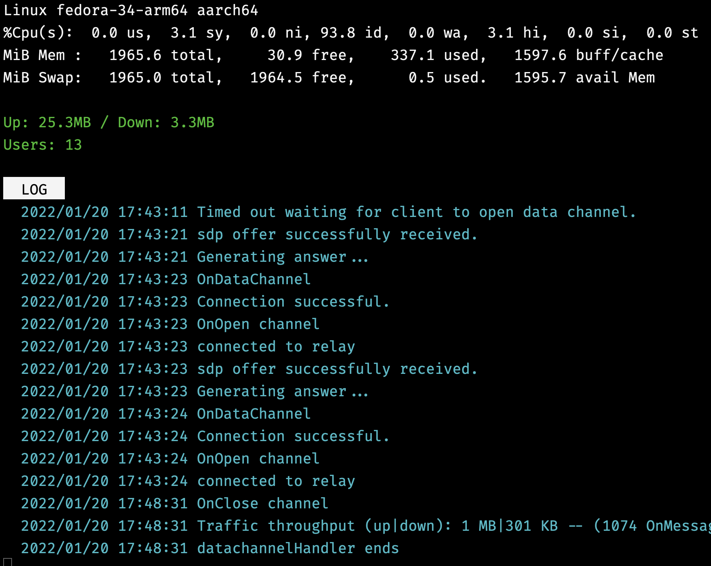

# 🧅 Piconyx

Piconyx is a command-line monitor for [Snowflake](https://github.com/keroserene/snowflake).
With this you can get detailed real-time information about your bridge.




## Dependencies

* `proxy`/snowflake: https://github.com/keroserene/snowflake

## Getting started

```terminal
$ git clone github.com/cristianrz/piconyx
```

install:

```term
# make install

$ piconyx ./snowflake_log_file.log
```

or run

```term
$ ./piconyx ./snowflake_log_file.log
```

if you always have the log file in the same place:

```term
$ echo 'alias piconyx="piconyx ./snowflake_log_file.log"' >> ~/.bashrc
```

